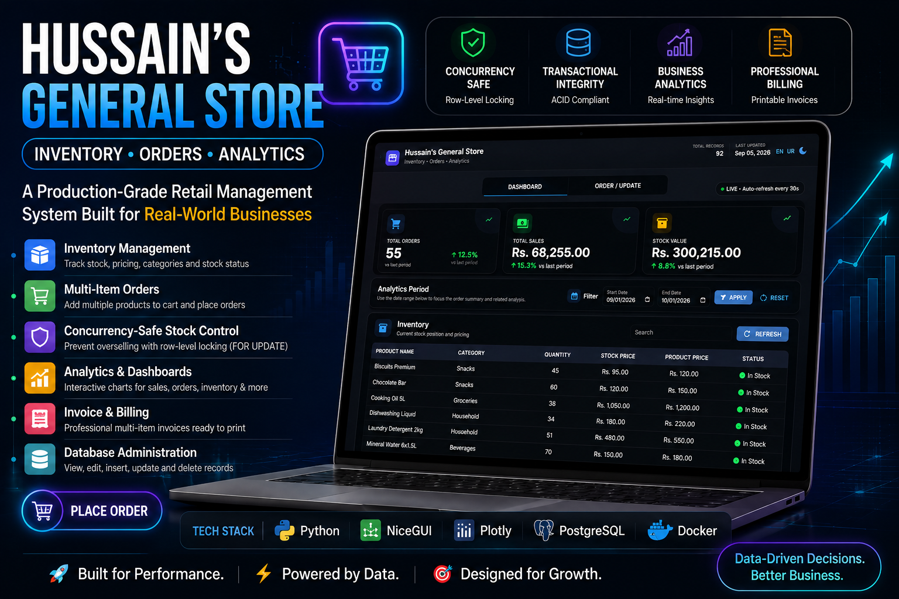

# 🏪 Hussain's General Store

## Production-Grade Inventory, Order Management & Analytics Platform

    


A production-oriented retail management system built with **Python, NiceGUI, Plotly, PostgreSQL, and Docker**.

The platform brings together **inventory management, transactional order processing, concurrency-safe stock control, printable billing, database administration, and business analytics** in one centralized application.

> **Inventory → Order Processing → Stock Validation → Transaction → Billing → Analytics**


---

## Dashboard Preview



---

---

## 🧭 Contents

- [Project Overview](#-project-overview)
- [Key Features](#-key-features)
- [Concurrency-Safe Inventory Control](#-concurrency-safe-inventory-control)
- [Business Analytics](#-business-analytics)
- [Invoice & Billing](#-professional-invoice--billing)
- [Database Architecture](#-database-architecture)
- [Dashboard](#-dashboard)
- [System Architecture](#-system-architecture)
- [Technology Stack](#-technology-stack)
- [Project Structure](#-project-structure)
- [Docker Deployment](#-containerized-deployment)
- [Quick Start](#-quick-start--windows)
- [Reliability & Security](#-reliability--data-integrity)
- [Testing](#-testing--validation)
- [Engineering Highlights](#-engineering-highlights)
- [Future Expansion](#-future-expansion)
- [Author](#-author)


---

### 🚀 Project Overview

**Hussain's General Store** is designed as a realistic retail management platform rather than a basic CRUD application.

The system focuses on the engineering challenges involved in building reliable business software:

- Accurate inventory management
- Concurrency-safe order processing
- Prevention of inventory overselling
- Transactional database operations with rollback support
- Precise financial calculations
- Fast analytical queries
- Database administration through a GUI
- Automatic dashboard updates after changes
- Professional printable invoices
- Persistent PostgreSQL storage
- Containerized deployment with Docker
- English and Urdu localization
- Responsive light/dark user interface
- **Multi-item orders (cart system)**

The architecture separates the **presentation, application, database-access, and database layers**, making the system easier to maintain, test, and extend.

---

# ✨ Key Features

## 📦 Inventory Management

- Product and category management
- Inventory quantity tracking
- Stock value tracking
- Product pricing
- Automatic stock-status calculation
- **In Stock / Low Stock / Out of Stock** states
- Low-stock indicators
- Search and filtering
- Sorting and pagination
- GUI-based record editing
- Safe deletion with confirmation
- Automatic inventory updates after successful orders

---

## 🛒 Multi-Item Order Management

The complete order workflow is handled through a database transaction.


```
Select Products (multiple items)
      ↓
Add to Cart
      ↓
Review Cart
      ↓
Validate Products
      ↓
Check Available Inventory
      ↓
Acquire Row-Level Lock
(SELECT ... FOR UPDATE)
      ↓
Create Order
      ↓
Deduct Inventory (for each item)
      ↓
Update Stock Status
      ↓
COMMIT
      ↓
Refresh Dashboard
      ↓
Generate Invoice (all items)
```


If any step fails:


```
ROLLBACK
```


This prevents partial orders, incorrect inventory quantities, negative stock caused by race conditions, and inconsistent database state.

---

## 🔐 Concurrency-Safe Inventory Control

The system uses PostgreSQL **pessimistic row-level locking** through:

sql

```
SELECT ... FOR UPDATE
```


This protects inventory when multiple users attempt to order the same product simultaneously.

### Example


```
Available Stock = 5

User A → Orders 4
         ↓
Stock becomes 1

User B → Attempts to order 4
         ↓
Insufficient stock
         ↓
Order rejected
```


---

# 💰 Financial Accuracy

Financial values use PostgreSQL `NUMERIC` / fixed-precision types rather than floating-point arithmetic.

This avoids common rounding problems in monetary calculations.


```
Quantity × Unit Price = Line Total
```


All monetary values are validated before being committed.

---

# 📊 Business Analytics

The dashboard provides business visibility through KPIs, analytical tables, and interactive Plotly visualizations.

### KPI Cards

- **Total Orders**
- **Total Sales**
- **Current Stock Value**
- **Total Records**

### 📈 Interactive Charts

Plotly is used for:

- Sales trends
- Order trends
- Sales vs. order-volume analysis
- Product performance
- Category performance
- Inventory distribution
- Stock-status distribution

Where appropriate, **dual-axis spline charts** compare metrics such as:


```
Sales Revenue
       vs.
Number of Orders
```


---

# 📅 Analytical Filtering

The dashboard provides date-based analytics filtering:


```
Start Date
End Date
Apply
Reset
```


The default range is the **current month**.

Filtering is performed at the database/query level where appropriate instead of unnecessarily loading the entire dataset into Python.

---

# 🧾 Professional Invoice & Billing

After a successful transaction, the application generates a printable retail invoice.

The invoice contains:


```
Hussain's General Store

Order Number
Order Date

Product Name
Product Category
Quantity
Unit Price
Total Amount

Grand Total (all items)
```


### Billing Workflow


```
Create Order (multi-item)
      ↓
Validate Inventory
      ↓
Commit Transaction
      ↓
Generate Invoice (all items)
      ↓
Preview Receipt
      ↓
Print / Save as PDF
```


The invoice is only considered valid after the order transaction has successfully committed.

---

# 🗄️ Database Architecture

PostgreSQL is the **source of truth** for the application.

The database is designed around relational integrity, transactional consistency, and analytical performance.

## Core Tables


```
categories
products
inventory
orders
order_items
suppliers
stock_transactions
audit_log
```


## Constraints

The schema uses:

- Primary keys
- Foreign keys
- Unique constraints
- NOT NULL constraints
- CHECK constraints
- Referential integrity
- Appropriate defaults
- Timestamp tracking

## Indexing

Indexes are created around frequently used access patterns such as:

- Product lookups
- Category filtering
- Order-date filtering
- Order-number lookup
- Foreign-key relationships
- Inventory queries
- Supplier queries

Indexes are selected based on query patterns rather than indiscriminately indexing every column.

---

# 👁️ Database Views

Reusable SQL views provide a clean interface for frequently used analytical queries.

### Inventory Status


```
v_inventory_status
```


Provides consolidated product and inventory information, including stock status.

### Order Summary


```
v_order_summary
```


Provides order-level analytical information grouped by date.

### Supplier Inventory


```
v_supplier_inventory
```


Combines supplier information with inventory-related data.

### Product Performance


```
v_product_performance
```


Provides product-level performance metrics such as order volume and revenue.

---

# ⚡ Materialized Views

Expensive analytical queries can use PostgreSQL materialized views to improve dashboard performance.

Current analytical materialized views:


```
mv_daily_sales
mv_monthly_sales
mv_product_sales_performance
mv_category_performance
mv_inventory_summary
```


These are used for optimized sales reporting and are automatically refreshed after transactional changes.

The design balances:


```
Data Freshness
      +
Query Performance
      +
Database Workload
```


---

# 🔄 Triggers & Automatic Database Behavior

Database triggers are used where appropriate for automatic data-management tasks.

Examples include:

- Automatic `updated_at` timestamps
- Automatic stock-status calculation
- Audit logging
- Order total recalculation
- Maintaining consistent record metadata
- Supporting database-level integrity rules

---

# 🖥️ Dashboard

The application uses **NiceGUI** for the web interface.

The layout is designed as a centralized business dashboard with a clean, professional visual style.

## Header


```
┌─────────────────────────────────────────────────────────┐
│ Total Records     Hussain's General Store     Last Updated │
└─────────────────────────────────────────────────────────┘
```


## Navigation


```
Dashboard
Order / Update
```


## Dashboard Sections

### Inventory


```
Product Name
Product Category
Quantity
Stock Price
Product Price
Stock Status
```


### Order Analytics


```
Order Date
Total Orders
Total Orders Price
```


### Suppliers


```
Supplier Name
Product Category
Stock Status
Stock Quantity
Supplier Number
```


---

# 🛠️ Database Administration

The **Order / Update** section provides a GUI for database management.

Users can select database tables and perform common administrative operations without writing SQL.

Supported operations include:


```
View
Search
Filter
Add
Edit
Delete
Refresh
```


The interface respects:

- Foreign keys
- Database constraints
- Validation rules
- Transactions
- Referential integrity

Destructive operations require confirmation.

---

# 🌐 Bilingual Interface

The application supports:

**English 🇬🇧 + Urdu 🇵🇰**

Examples:

| **English** | **Urdu** |          |
|---|---|
| Dashboard       | ڈیش بورڈ |
| Inventory       | اسٹاک    |
| Orders          | آرڈرز    |
| Products        | مصنوعات  |
| Suppliers       | سپلائرز  |
| Quantity        | مقدار    |
| Price           | قیمت     |
| Total           | کل       |

---

# 🎨 UI & UX

The dashboard includes:

- Light mode
- Dark mode
- Responsive design
- Animated KPI counters
- Interactive Plotly charts
- Searchable tables
- Sortable tables
- Pagination
- Modal order forms (multi-item cart)
- Blurred-background dialogs
- Floating **Place Order** action
- Notifications for success, warning, and errors
- Loading states
- Empty states
- Error handling

The design intentionally avoids excessive colors and unnecessary visual elements in favor of a **clean, professional, classical business aesthetic**.

---

# 🧩 System Architecture


```
┌─────────────────────────────────────────────┐
│           Presentation Layer                │
│        NiceGUI + Plotly Dashboard           │
└──────────────────────┬──────────────────────┘
                       │
                       ▼
┌─────────────────────────────────────────────┐
│            Application Layer                │
│       Python Services + Business Logic      │
│     Validation + Transactions + Locking    │
└──────────────────────┬──────────────────────┘
                       │
                       ▼
┌─────────────────────────────────────────────┐
│          Database Access Layer              │
│     asyncpg + Connection Pooling            │
└──────────────────────┬──────────────────────┘
                       │
                       ▼
┌─────────────────────────────────────────────┐
│               Database Layer                │
│ PostgreSQL + Constraints + Indexes + Views │
│      Materialized Views + Triggers         │
└─────────────────────────────────────────────┘
```


---

# 🛠️ Technology Stack

| **Technology** | **Purpose** |                                                |
|---|---|
| **Python**            | Application and business logic                 |
| **NiceGUI**           | Web dashboard and user interface               |
| **Plotly**            | Interactive analytics and visualization        |
| **PostgreSQL 16**     | Relational database                            |
| **asyncpg**           | PostgreSQL connectivity                        |
| **Docker**            | Containerization                               |
| **Docker Compose**    | Service orchestration                          |
| **SQL**               | Database schema, queries, views, and analytics |
| **Windows Batch**     | One-click local startup                        |

---

# 📁 Project Structure


```
Full_Store/
│
├── Dashboard/
│   ├── __init__.py
│   ├── __main__.py
│   ├── app.py              # Main NiceGUI application
│   ├── config.py           # Configuration management
│   ├── database.py         # Database access layer
│   ├── i18n.py             # Internationalization (EN/UR)
│   └── utils.py            # Utility functions
│
├── init.sql                # Database schema and seed data
├── Dockerfile
├── docker-compose.yml
├── .env
├── .env.example
├── requirements.txt
├── Start_System.bat
└── README.md
```


---

# 🐳 Containerized Deployment

The complete application runs through Docker Compose.


```
Docker Compose
│
├── PostgreSQL (postgres:16-alpine)
│
└── NiceGUI Application (python:3.11-slim)
```


### Infrastructure Features

- PostgreSQL health checks
- Persistent database volumes
- Environment-based configuration
- Service dependency management
- Automatic restart behavior
- Isolated Docker networking
- Application startup after database readiness

---

# 🚀 Quick Start — Windows

## Prerequisites

Install:

- [Docker Desktop](https://www.docker.com/products/docker-desktop/)
- Git
- A modern web browser

Make sure Docker Desktop is running.

## One-Click Startup

From Windows Explorer, double-click:


```
Start_System.bat
```


The startup script is designed to:


```
Check Docker
      ↓
Start required containers
      ↓
Build only when necessary
      ↓
Start PostgreSQL
      ↓
Start NiceGUI application
      ↓
Open the dashboard
```


Then access:


```
http://localhost:8080
```


---

# 🧰 Manual Startup

Navigate to the project root:

bash

```
cd Full_Store
```


Create the environment configuration:

bash

```
cp .env.example .env
```


Edit `.env` with your local configuration.

Start the application:

bash

```
docker compose up -d --build
```


Check running services:

bash

```
docker compose ps
```


View logs:

bash

```
docker compose logs -f
```


Open the dashboard:


```
http://localhost:8080
```


---

# ⚙️ Environment Configuration

The application reads configuration values from `.env`.

Example:

env

```
POSTGRES_HOST=postgres
POSTGRES_PORT=5432
POSTGRES_DB=store_inventory
POSTGRES_USER=postgres
POSTGRES_PASSWORD=postgres

APP_HOST=0.0.0.0
APP_PORT=8080

STORE_NAME=Hussain's General Store

LOW_STOCK_THRESHOLD=10
```


> ⚠️ **Never commit real passwords, API keys, or production secrets to GitHub.**

Use `.env.example` as the template for new environments.

---

# 💾 Data Persistence

PostgreSQL uses persistent Docker storage so database data survives normal container lifecycle operations.

Data remains available across:

- Application restarts
- Container restarts
- Container recreation
- Application rebuilds

Normal startup does **not** intentionally delete existing database data.

---

# 🔒 Reliability & Data Integrity

The system uses multiple layers of protection:


```
Database Constraints
        +
Transactions
        +
Row-Level Locking
        +
Parameterized SQL
        +
Input Validation
        +
Connection Pooling
        +
Rollback Handling
```


These protections help prevent:

- Inventory overselling
- Negative stock
- Duplicate order numbers
- Invalid foreign-key relationships
- Partial transactions
- Unsafe SQL execution
- Incorrect financial calculations

---

# 🔐 Security Practices

The project follows secure application practices including:

- Environment-based credentials
- Parameterized SQL queries
- Input validation
- Database constraints
- Transaction handling
- Limited database exposure
- No hard-coded production secrets
- Safe error handling

Technical database errors should be logged for developers without exposing sensitive implementation details to normal users.

---

# 📈 Performance & Scalability

The application is designed with performance in mind.

Performance strategies include:

- Database-level aggregation
- Purposeful indexes
- SQL views
- Materialized views (auto-refreshed)
- Connection pooling
- Server-side filtering
- Pagination
- Parameterized queries
- Reduced unnecessary database round trips

The goal is to keep analytical workloads efficient as the number of products, orders, and inventory records grows.

---

# 🔮 Future Expansion

The architecture can be extended to support:

- Multi-store / branch management
- User authentication
- Role-based access control
- Customer management
- Payments
- Discounts
- Taxes
- Returns and refunds
- Purchase orders
- Supplier transactions
- Advanced audit trails
- Barcode scanning
- REST API
- Mobile client
- Advanced reporting

---

# 🧪 Testing & Validation

Important workflows should be validated before deployment.

### Database

- Schema initialization
- Primary and foreign keys
- Constraints
- Indexes
- Views
- Materialized views
- Triggers
- Transactions
- Rollbacks

### Order Processing

- Valid order (single item)
- Valid order (multi-item cart)
- Insufficient stock
- Concurrent orders
- Inventory deduction
- Stock-status updates
- Order-number uniqueness
- Invoice generation

### Dashboard

- KPI accuracy
- Date filtering
- Inventory refresh
- Order refresh
- Chart updates
- Dark/light mode
- English/Urdu switching
- Responsive layout

### Docker

- Container startup
- Health checks
- Database persistence
- Environment configuration
- Container restart behavior
- Application/database connectivity

---

# 🎯 Engineering Highlights

### 🗄️ Database Engineering

- PostgreSQL schema design
- Relational normalization
- Primary/foreign keys
- Constraints
- Indexing
- SQL views
- Materialized views
- Triggers
- Transaction management
- Row-level locking

### 🐍 Python Development

- Application architecture
- Business logic
- Database integration
- Validation
- Error handling
- Modular UI components
- Connection pooling

### 📊 Data Analytics

- SQL aggregations
- KPI design
- Time-series analysis
- Product performance analysis
- Inventory analytics
- Interactive Plotly dashboards

### 🎨 UI/UX

- Professional dashboard design
- Responsive layouts
- Dark/light themes
- Bilingual interface
- Animated KPIs
- Modal workflows (multi-item cart)
- Printable invoice interface

### 🐳 DevOps

- Docker
- Docker Compose
- Health checks
- Persistent volumes
- Environment configuration
- Automated Windows startup

---

# 📸 Screenshots & Demo

Add application screenshots here to make the repository easier to understand at a glance.

Recommended screenshots:


```
01-dashboard.png
02-analytics.png
03-inventory.png
04-place-order-multi.png
05-invoice.png
06-database-admin.png
07-dark-mode.png
08-urdu-interface.png
```


Example:


```

```


A short GIF or demo video showing the complete **Place Order → Inventory Update → Invoice → Dashboard Refresh** workflow would make the project even stronger.

---

# 🔄 Complete Business Workflow


```
                    USER
                     │
                     ▼
              Open Dashboard
                     │
                     ▼
         Select Products (multiple)
                     │
                     ▼
              Add to Cart
                     │
                     ▼
              Review Cart
                     │
                     ▼
              Validate Request
                     │
                     ▼
           Lock Inventory Rows
                     │
                     ▼
             Verify Stock
                /       \
          Available     Insufficient
              │              │
              ▼              ▼
        Create Order       Reject
              │
              ▼
       Deduct Inventory
              │
              ▼
      Update Stock Status
              │
              ▼
             COMMIT
              │
       ┌──────┴──────┐
       ▼             ▼
Refresh Dashboard   Invoice
                     │
                     ▼
                  Print
```


---

# 🧠 Design Philosophy

The system follows one central principle:

> **The database is the source of truth, and business-critical operations must remain correct even under concurrent activity.**

That principle drives the use of:

- Transactional order processing
- Row-level locking
- Database constraints
- Proper numeric types
- Indexed queries
- Analytical views
- Materialized views (auto-refreshed)
- Safe database administration

The goal is not simply to make the application work, but to make it **reliable, maintainable, and scalable**.

---

# 💼 Portfolio Highlights

This project demonstrates end-to-end engineering across **application development, relational database design, transactional workflows, analytics, UI/UX, and containerized deployment**.

The strongest technical story is the complete retail workflow: a user creates a multi-item order, inventory is validated under a database transaction, stock is safely deducted, the dashboard refreshes, and a printable invoice is produced.

# 👨‍💻 Author

## Hussain Ali

**Data Engineering Aspirant | Python & SQL Specialist**

Interested in:


```
Python
SQL
Database Engineering
Data Engineering
ETL / ELT
Automation
Analytics
Backend Development
Docker
```


---

# 📄 License

This project is currently intended for **educational, portfolio, and development purposes**.

Add an open-source license such as MIT if you plan to distribute the project publicly.

---

# ⭐ Support

If you find this project useful or interesting, consider giving the repository a ⭐ and sharing your feedback.

---

## 🏪 Built With

**Python • NiceGUI • Plotly • PostgreSQL • asyncpg • Docker • SQL**